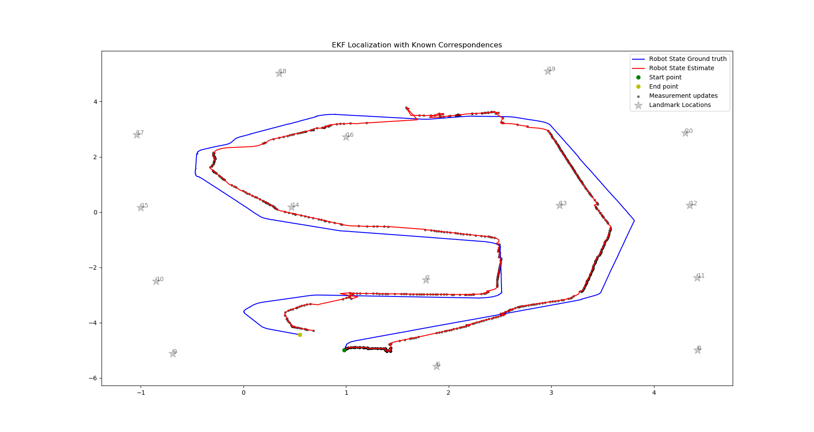

# SLAM Algorithm Implementation - Probabilistic Robotics
#### Chenge Yang, 2019 Winter, Northwestern University
-----------------------------------------------------------------------------------------
## 1. Introduction
This project contains Python3 implementations and results of a variety of state estimation and SLAM algorithms in Sebastian Thrun's book **Probabilistic Robotics** using **UTIAS Multi-Robot Cooperative Localization and Mapping** dataset.

As a beginner in SLAM, I always found it difficult to understand the non-intuitive mathematical equations, and I can barely find straightforward instructions on implementing these algorithms. Therefore, I created this repo to demonstrate the basic concepts behind the book, paired with results running on a simple dataset.

If you are new to SLAM problem and is reading the book Probabilistic Robotics, this repo will be perfect for you - I programmed in Python not C++ with abundant inline comments and good demonstrations of the results.

If you find anything wrong with my implementations, such as inappropriate understanding or code bugs, please leave a comment!

#### Table of Contents
- [1. Introduction](#1-Introduction)
- [2. Dataset](#2-Dataset)
- [3. Basic Algorithm](#3-Basic-Algorithm)
- [4. Localization](#4-Localization)
  - [4.1. EKF Localization](#41-EKF-Localization)
  - [4.2. Particle Filter Localization](#42-Particle-Filter-Localization)
- [5. EKF SLAM](#5-EKF-SLAM)
  - [5.1. EKF SLAM with Known Correspondence](#51-EKF-SLAM-with-Known-Correspondence)
  - [5.2. EKF SLAM with Unknown Correspondence](#52-EKF-SLAM-with-Unknown-Correspondence)
- [6. Graph SLAM](#6-Graph-SLAM)
  - [6.1. Graph SLAM with Known Correspondence](#61-Graph-SLAM-with-Known-Correspondence)
- [7. Fast SLAM 1](#7-Fast-SLAM-1)
  - [7.1. Fast SLAM 1 with Known Correspondence](#71-Fast-SLAM-1-with-Known-Correspondence)
  - [7.2. Fast SLAM 1 with Unknown Correspondence](#72-Fast-SLAM-1-with-Unknown-Correspondence)
- [8. Fast SLAM 2](#8-Fast-SLAM-2)
  - [8.1. Fast SLAM 2 with Unknown Correspondence](#81-Fast-SLAM-2-with-Unknown-Correspondence)
-----------------------------------------------------------------------------------------
## 2. Dataset
**UTIAS Multi-Robot Cooperative Localization and Mapping** is 2D indoor feature-based dataset. For details please refer [here](http://asrl.utias.utoronto.ca/datasets/mrclam/index.html).

This project contains [Dataset0](0.Dataset0/) (MRSLAM_Dataset4, Robot3) and [Dataset1](0.Dataset1/) (MRCLAM_Dataset9, Robot3). All algorithms are using Dataset1 to generate the following results.

Each dataset contains five files:
* **Odometry.dat**: Control data (translation and rotation velocity)
* **Measurement.dat**: Measurement data (range and bearing data for visually observed landmarks and other robots)
* **Groundtruth.dat**: Ground truth robot position (measured via Vicon motion capture – use for assessment only)
* **Landmark_Groundtruth.dat**: Ground truth landmark positions (measured via Vicon motion capture)
* **Barcodes.dat**: Associates the barcode IDs with landmark IDs.

The data is processed in the following way:
* Use all Odometry data
* Only use Measurement data for landmark 6 ~ 20 (1 ~ 5 are other robots)
* Use Groundtruth data to plot the robot state ground truth
* Use Landmark Groundtruth only for localization problem
* Associate Landmark Groundtruth with Barcodes to get landmark index from measurement
* Combine Odometry data with Measurement data ans sort by timestamp as input data

-----------------------------------------------------------------------------------------
## 3. Basic Algorithm
All algorithms are using the same motion and measurement model:
* Motion model: Motion Model Velocity (simplified from PR P127)
* Measurement model: Feature-Based Measurement Model (PR P178)

The robot trajectory using only Odometry data is shown in the figure below. In general, the Odometry data is giving a relatively fine initial estimate of the robot pose. But there are significant drifting along with time.

  

-----------------------------------------------------------------------------------------
## 4. Localization
Two filter-based localization algorithms are implemented:
* Parametric model: Extended Kalman Filter based localization
* Non-parametric model: Particle Filter based localization

Localization assumes known landmark locations and correspondences. Thus, both algorithms demonstrate good results.

### 4.1. EKF Localization
Probabilistic Robotics Page 204: **Algorithm EKF_Localization_known_correspondences**.

  

### 4.2. Particle Filter Localization
Probabilistic Robotics Page 252: **Algorithm MCL**.

  

-----------------------------------------------------------------------------------------
## 5. EKF SLAM
EKF SLAM applies EKF to SLAM problem with the following features:
* Feature-based map (landmarks)
* Assume Gaussian noise for motion and measurement models
* Maximum Likelihood data association

### 5.1. EKF SLAM with Known Correspondence
Probabilistic Robotics Page 314: **Algorithm EKF_SLAM_known_correspondences**.

The overall process is not very smooth because of inaccurate odometry data and a lack of information in measurement (each measurement only observes single landmark). But with known correspondences, the algorithm can still converge.

  

### 5.2. EKF SLAM with Unknown Correspondence
Probabilistic Robotics Page 321: **Algorithm EKF_SLAM**.

The algorithm generates very similar estimate at the beginning compared with algorithm 5.1. However, with inaccurate odometry data, data association cannot work as expected and gives bad correspondences at the end, which degrades both landmark and robot state estimates.

  

-----------------------------------------------------------------------------------------
## 6. Graph SLAM
Graph SLAM is the only optimization-based SLAM algorithm implemented in this project. It has the following features:
* Not online SLAM algorithm - require full data when running
* Construct Information Matrix and Information Vector from control and measurement constraints
* Apply factorization to reduce dimensions of Information Matrix and Information Vector
* Solve with least square method

### 6.1. Graph SLAM with Known Correspondence
Probabilistic Robotics Page 350: **Algorithm GraphSLAM_known_correspondences**.

Graph SLAM computes the best estimate for the full SLAM problem. Thus, the global estimate will be influenced by local errors. This is demonstrated in the four plots below.

When running graph SLAM for the short time, it can give highly accurate estimate. But when running on full problem, the trajectory drifts off significantly. This is because the odometry and measurement data are getting less informative towards the end of the period.

  

-----------------------------------------------------------------------------------------
## 7. Fast SLAM 1
Fast SLAM applies Rao-Blackwellized Particle Filter to SLAM problem. It has the following features:
* Factorize SLAM problem into two independent sub-problems: localization and mapping
* Use Particle Filter to estimate robot state (localization)
* Use EKF to estimate each landmark state (mapping)

### 7.1. Fast SLAM 1 with Known Correspondence
Probabilistic Robotics Page 450: **Algorithm FastSLAM 1.0_known_correspondences**.

  

### 7.2. Fast SLAM 1 with Unknown Correspondence
Probabilistic Robotics Page 461: **Algorithm FastSLAM 1.0**.

  

-----------------------------------------------------------------------------------------
## 8. Fast SLAM 2
The main difference between Fast SLAM 2.0 and Fast SLAM 1.0 is that when sampling new pose, Fast SLAM 2.0 incorporates the measurement information. However, this makes implementing the algorithm a lot more difficult.

### 8.1. Fast SLAM 2 with Unknown Correspondence
Probabilistic Robotics Page 463: **Algorithm FastSLAM 2.0**.

  

-----------------------------------------------------------------------------------------
